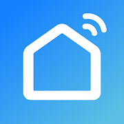
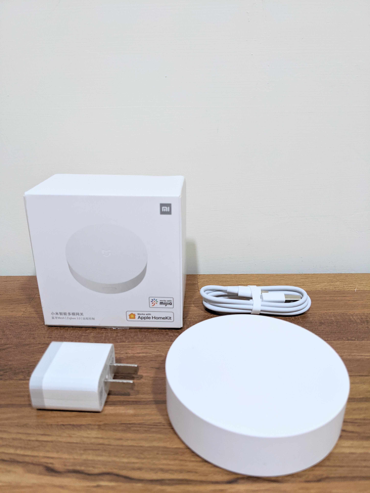
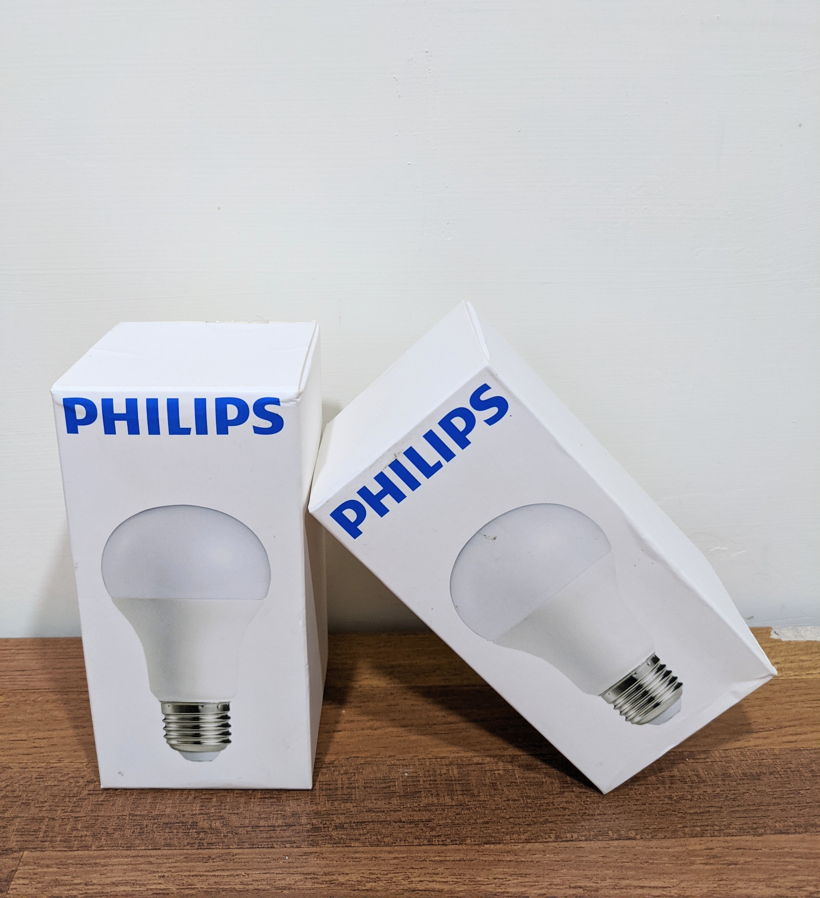
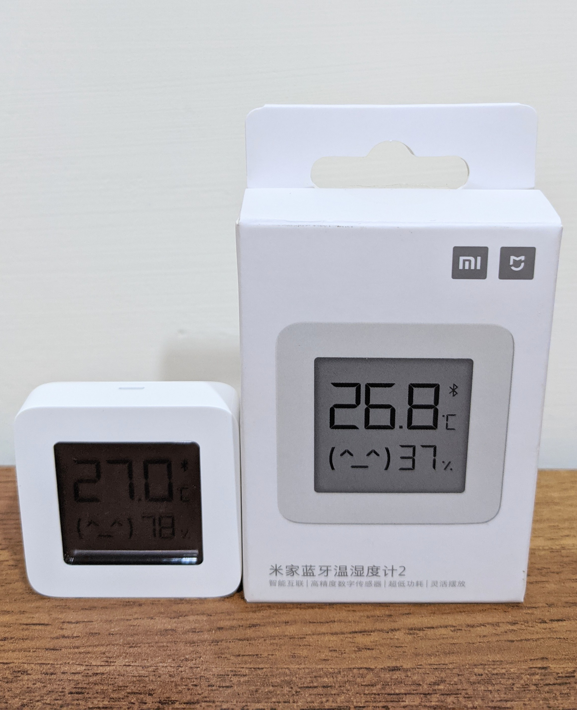
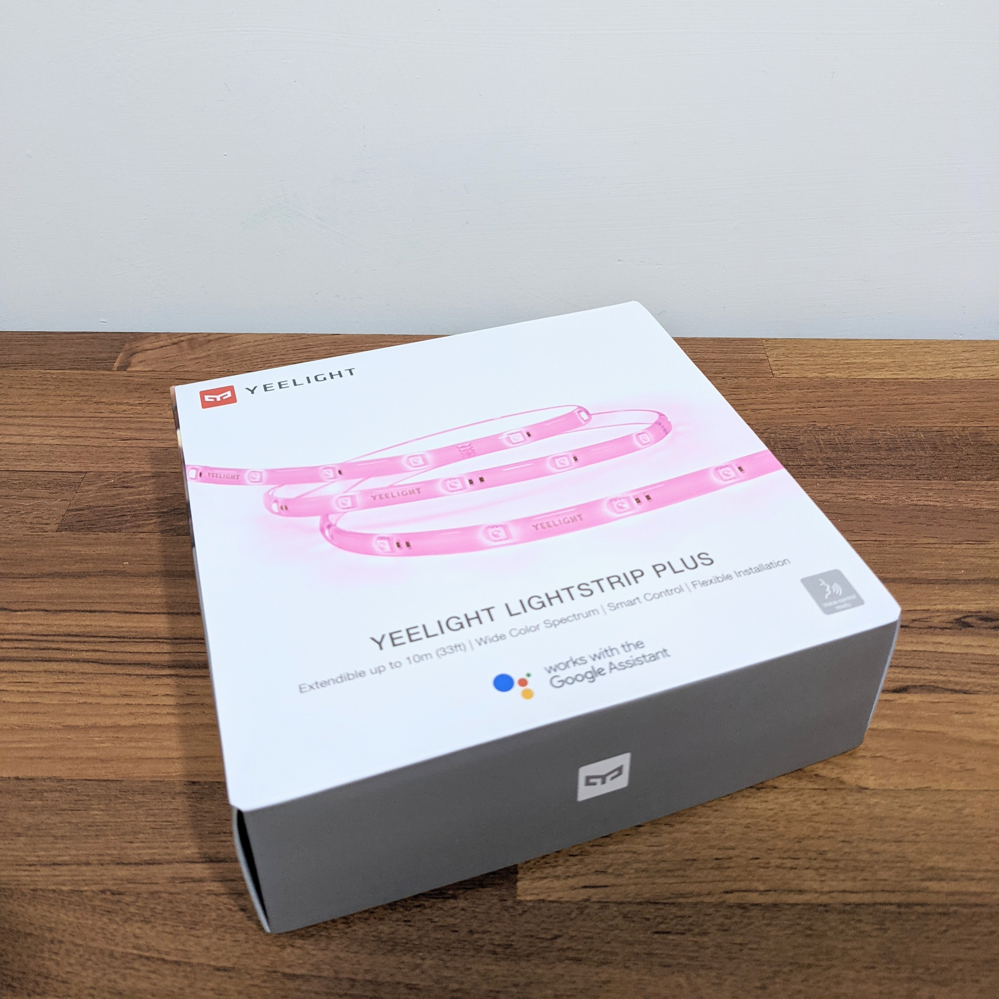
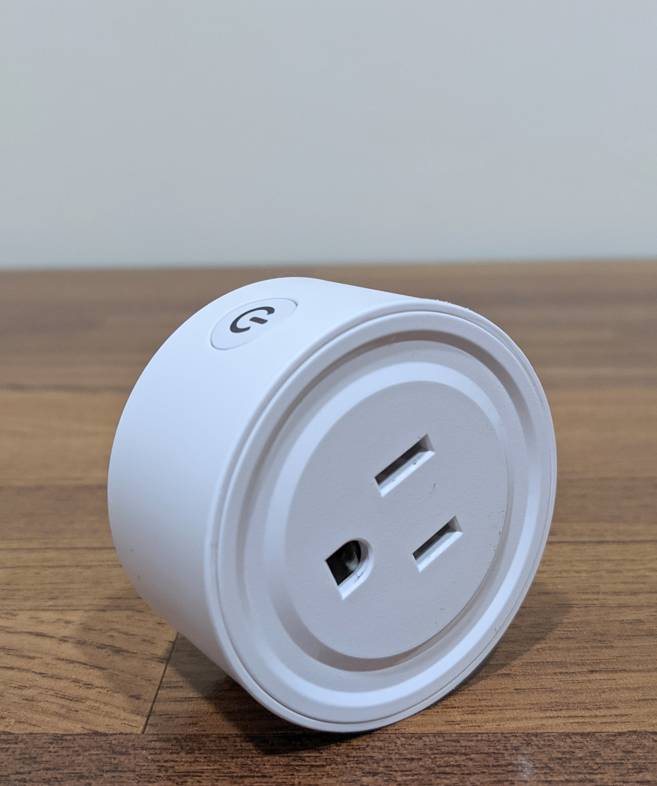
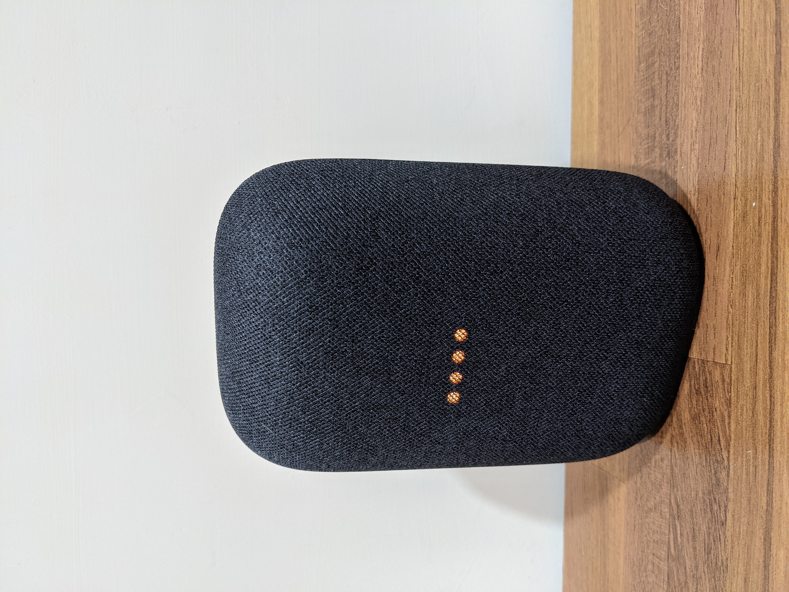

# Home Assistant Configuration
What is Home Assistant? 
>Open source home automation that puts local control and privacy first. Powered by a worldwide community of tinkerers and DIY enthusiasts. Perfect to run on a Raspberry Pi or a local server.

# 資源
## Useful link
[HA官網](https://www.home-assistant.io/)\
[Material Design Icon](https://materialdesignicons.com/)
## Mobile APP
+ from apk:\
  [MiHome mod](https://www.kapiba.ru/2017/11/mi-home.html)(推薦安裝,取得米家裝置隱藏資訊)
+ from google play:\
  

# 整合元件
## 硬體
+ 米家智能多模網關\
  

+ 米家飛利浦智睿燈泡\
  Shopee一顆200有找,需挑選可用於110V的,需透過[MiHome mod](https://www.kapiba.ru/2017/11/mi-home.html)找出token\
  解決[飛利浦智睿球泡燈 無法連線](https://www.mobile01.com/topicdetail.php?f=168&t=5504047&p=2#79311340):hammer::hammer::hammer:\
  

+ 米家藍芽溫濕度計2
  官方僅支援一代,二代設定請見[mitemp_bt](https://github.com/custom-components/sensor.mitemp_bt),需透過[MiHome mod](https://www.kapiba.ru/2017/11/mi-home.html)找出bind_key:sunglasses:\
  

+ [Yeelight 智能彩光燈帶](https://www.home-assistant.io/integrations/yeelight/)\
  不要只買延長包:warning:\
  不要用米家APP初始化:warning:
  

    
上一個這麼做的....

    又重新初始化一次設備
     
    
  

  

+ [TUYA 插座](https://www.home-assistant.io/integrations/tuya/)\
  透過[Smart Life](https://play.google.com/store/apps/details?id=com.tuya.smartlife)雲端連動,控制通電斷電,有錢的同學可以考慮買有電流計功能的\
  :open_mouth::open_mouth::open_mouth::open_mouth::open_mouth::open_mouth::open_mouth::open_mouth::open_mouth::open_mouth::open_mouth::open_mouth::open_mouth::open_mouth::open_mouth::open_mouth::open_mouth::open_mouth::open_mouth::open_mouth::open_mouth::open_mouth::open_mouth::open_mouth::open_mouth:\
  

+ 手機感測器(電量,步數,光感,位置....各種手機狀態)
  新增第二個device時,entities跑到第一個device,使用不同user登入才解決:hammer::hammer::hammer:

+ [Android IP Webcam](https://www.home-assistant.io/integrations/android_ip_webcam/) & [APP](https://play.google.com/store/apps/details?id=com.pas.webcam&hl=zh_TW)

+ [Nest Audio](https://store.google.com/tw/product/nest_audio)\
  

## 服務
+ Home Assistant Cloud\
  每月150保護費,外網控制與網路安全

+ [HACS](https://hacs.xyz/docs/installation/manual_cli)
  >What can HACS do?\
HACS is a manager for installing and maintaining custom elements for Home Assistant.\
It can help you download and update elements, and can also help you discover new and awesome stuff!
+ spotify
+ Media player
+ google calender
+ [Speedtest.net](https://www.home-assistant.io/integrations/speedtestdotnet)\
  可以即時看網路速度

# Features
## 自動化
|名稱                        |行為|
|-                           |-|
|snapshot_full in the weekend|每周備份|
|Stop dehumidification       |濕度低於65關閉除溼機|
|Time to wake up!            |08:00:00啟動daybreak場景|
|Time to relax~              |18:00:00啟動relax場景|
|Time to sleep~              |01:00:00啟動sleep場景|

## 場景
+ daybreak
+ faint
+ relax
+ sleep
+ welcome
+ blackout
