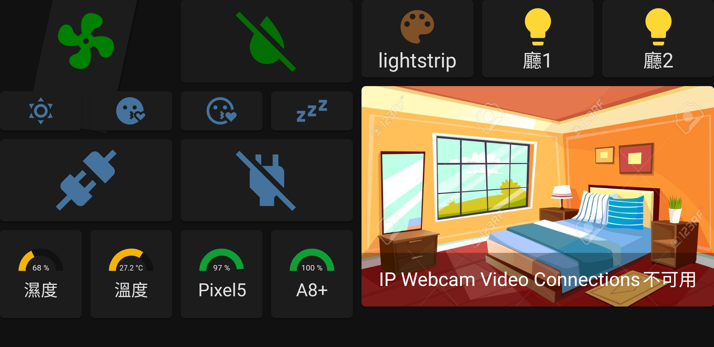

# Home Assistant Configuration

What is Home Assistant? 
>Open source home automation that puts local control and privacy first. Powered by a worldwide community of tinkerers and DIY enthusiasts. Perfect to run on a Raspberry Pi or a local server.

[](https://play.google.com/store/apps/details?id=com.google.android.apps.chromecast.app&hl=zh_TW)[](https://assistant.google.com/)[](https://calendar.google.com/calendar)[](https://keep.google.com/)

[](https://www.mi.com/tw/)[](https://www.home-assistant.io/)[](https://www.yeelight.com/)[](https://www.tuya.com/)[](https://play.google.com/store/apps/details?id=com.tuya.smartlife&hl=zh_TW)

[](https://www.spotify.com/tw/)[](https://play.google.com/store/apps/details?id=com.pas.webcam&hl=zh_TW)[](https://www.raspberrypi.org/)
# :fleur_de_lis:功能
## 場景
+ daybreak = :sunny:
+ weak = :crescent_moon:
+ relax = :kissing_heart:
+ sleep = :zzz:
+ welcome = :house:
+ blackout = :runner:
## 定時啟動
+ snapshot_full in the weekend\
  每周備份系統
+ Stop dehumidification\
  濕度低於65關閉除溼機,:loud_sound:提示
+ 啟動場景,:loud_sound:提示,設定音量,播放音樂
  + :sunny:Time to wake up at 8 a.m.
  + :kissing_heart:Time to relax at 6 p.m.
  + :crescent_moon:Time to sleep at 12 p.m.

## 語音啟動+
透過GA語音執行home assistant script
+ 出門
  :lips:: ```I'm off```, ```I'm off now```
  :robot:: :runner: + :loud_sound:```remember to take your wallet, phone and key``` + stop music:mute:

  用leaving一直被辨認成living :confused:
+ 回家
  :lips:: ```I'm home```, ```I'm back```
  :robot:: :house: + play  music
+ 睡覺
  :lips:: ```good night```, ```It's bedtime```, ```I'm going to sleep```, ```I'm going to bed```
  :robot:: :zzz: + stop music:mute:

# :fleur_de_lis:整合元件
## <center><span style="color:blue">G</span><span style="color:red">o</span><span style="color:orange">o</span><span style="color:blue">g</span><span style="color:green">l</span><span style="color:red">e</span></center>
+ [ Google calender](https://www.home-assistant.io/integrations/calendar.google/)\
  ~~總之,照著說明操作~~\
  總之就是透過google cloud API,設定一組```OAuth client```給HA用
  [What's Google OAuth 2.0](http://vito-note.blogspot.com/2015/04/google-oauth-20.html)
  >例如： 若一個 APP 要存取你存放在 Google Blogger 中非公開的資訊，則這個 APP 必須要先獲得你「同意授權」，就可以存取這些非公開的資訊，而不需要你提供帳號密碼給這個 APP 知道。 

+ Google assistant + Google home
  須讓HA有外網IP,有兩種做法,duckDNS看起來太麻煩,我選擇交每月交5鎂保護費:smirk:\
  然後就可以直接讓同步的部分裝置與場景,當然也就可以透過語音控制啦!
  像是把裝置設定複製到的感覺?
  應用方式:
  + 透過設定```日常安排(routine)```,即可以特定命令啟動腳本
  + 重新命名裝置後直接語音控制

+ [ Nest Audio](https://store.google.com/tw/product/nest_audio)\
   :heavy_plus_sign:  :heavy_plus_sign:  :heavy_plus_sign: :musical_note: :heavy_plus_sign: :microphone:\
  

+ TODO:   keep

## <center></center>
+ 米家智能多模網關\
  

+ 米家飛利浦智睿燈泡\
  Shopee一顆200有找,需挑選可用於110V的,需透過[MiHome mod](https://www.kapiba.ru/2017/11/mi-home.html)找出```token```\
  解決[飛利浦智睿球泡燈 無法連線](https://www.mobile01.com/topicdetail.php?f=168&t=5504047&p=2#79311340):hammer::hammer::hammer:\
  

+ 米家藍芽溫濕度計2
  官方僅支援一代,二代設定請見[mitemp_bt](https://github.com/custom-components/sensor.mitemp_bt),需透過[MiHome mod](https://www.kapiba.ru/2017/11/mi-home.html)找出```bind_key```:sunglasses:\
  
## <center>Others</center>
+ [Yeelight 智能彩光燈帶](https://www.home-assistant.io/integrations/yeelight/)\
  不要只買延長包:warning:\
  不要用米家APP初始化:warning:
  <details>
    <summary>上一個這麼做的....</summary>
    又重新初始化一次設備
    <br/>
    
  </details>
  

+ [TUYA 插座](https://www.home-assistant.io/integrations/tuya/)\
  透過[Smart Life](https://play.google.com/store/apps/details?id=com.tuya.smartlife)雲端連動,控制通電斷電,有錢的同學可以考慮買有電流計功能的\
  :open_mouth::open_mouth::open_mouth::open_mouth::open_mouth::open_mouth::open_mouth::open_mouth::open_mouth::open_mouth::open_mouth::open_mouth::open_mouth::open_mouth::open_mouth::open_mouth::open_mouth::open_mouth::open_mouth::open_mouth::open_mouth::open_mouth::open_mouth::open_mouth::open_mouth:\
  

+ [Spotify](https://www.home-assistant.io/integrations/spotify/)
  從[Spotify Developer](https://developer.spotify.com/)創建APP並取得```Client ID``` and ```Client Secret```
  ```nest audio```當做藍芽音響連接舊手機,並將舊手機設成預設播放器
   ->   -> 舊手機 ->   -> ```nest audio```
+ mobile phone sensor(電量,步數,光感,位置....各種手機狀態)
  新增第二個device時,entities跑到第一個device,使用不同user登入才解決:hammer::hammer::hammer:
+ [Mopidy](https://github.com/kentloving/hassio-addons/tree/master/mopidy)(讓pi可以播放聲音)
+ [Android IP Webcam](https://www.home-assistant.io/integrations/android_ip_webcam/) & [APP](https://play.google.com/store/apps/details?id=com.pas.webcam&hl=zh_TW)
+ [Speedtest.net](https://www.home-assistant.io/integrations/speedtestdotnet)(可以即時看網路速度)
+ Home Assistant Cloud(每月150保護費,外網控制與網路安全)

# :fleur_de_lis:資源
## Useful link
+ [HA官網](https://www.home-assistant.io/)
+ [Material Design Icon](https://materialdesignicons.com/)
+ [MiHome mod](https://www.kapiba.ru/2017/11/mi-home.html)(推薦安裝,取得米家裝置隱藏資訊)
 